

  

<h1 align="center">Render Gallery</h1>

  A full collection of renders produced by this ray tracer. 
  New renders are added as the project evolves.

  <a href="README.md">← Back to README</a>

---

## Meshes

<table>
  <tr>
    <td align="center" width="33%">
      
       Stanford Bunny — smooth metal
    </td>
    <td align="center" width="33%">
      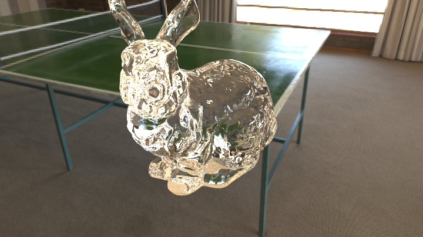
       Stanford Bunny — glass
    </td>
    <td align="center" width="33%">
      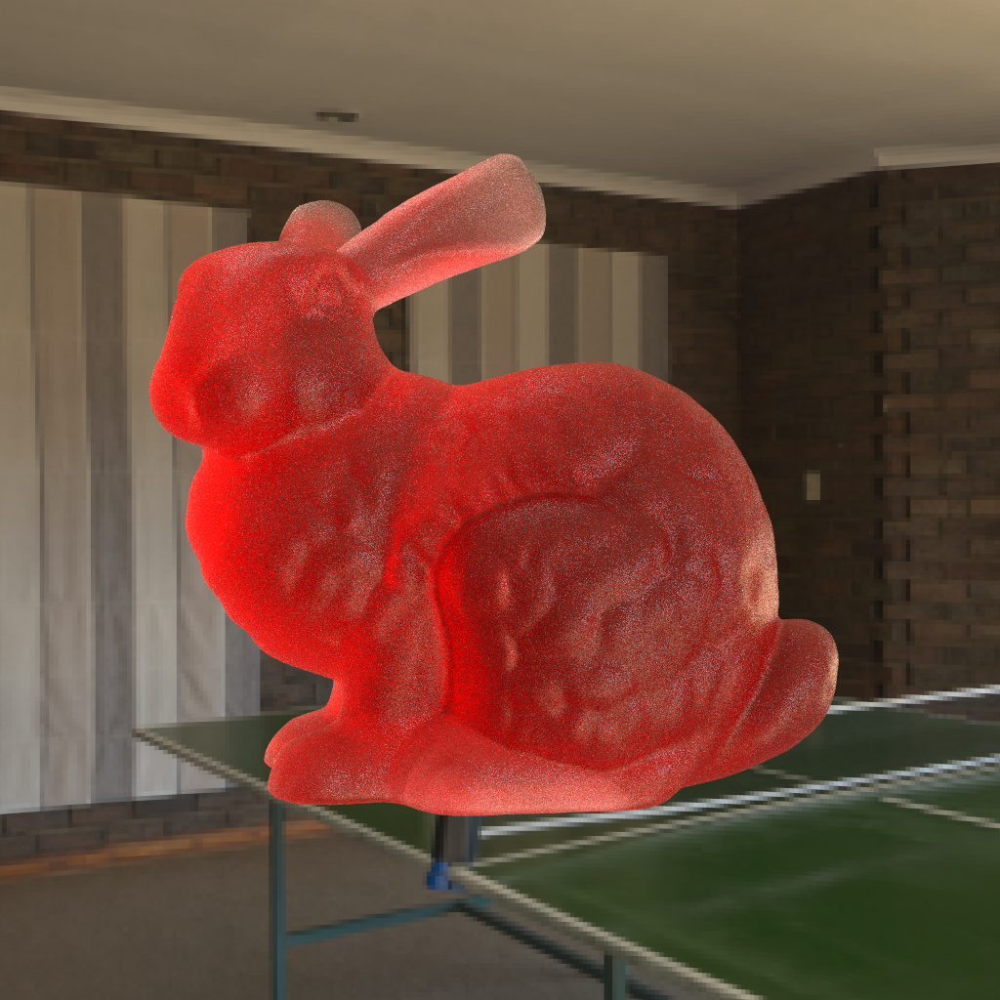
       Stanford Bunny — frosted glass
    </td>
  </tr>
  <tr>
    <td align="center" width="33%">
      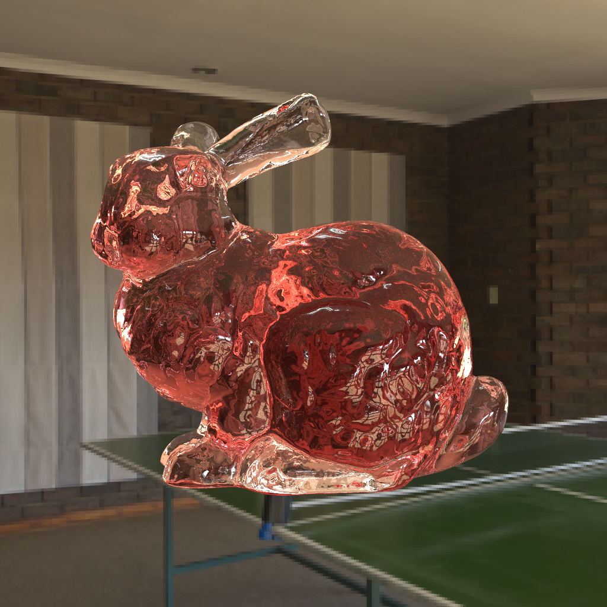
       Stanford Bunny — red tinted glass
    </td>
    <td align="center" width="33%">
      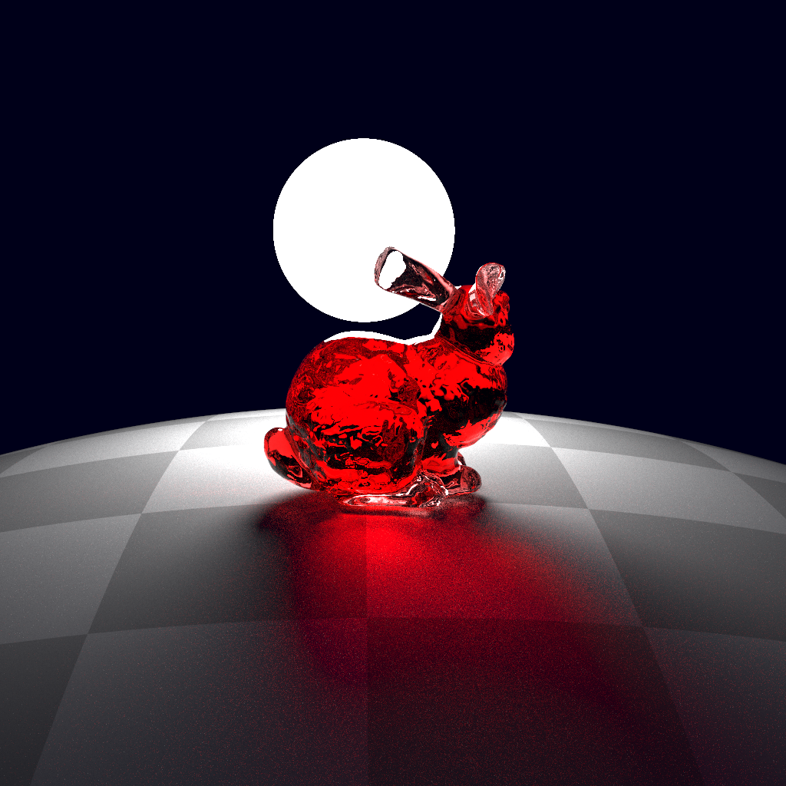
       Stanford Bunny — red glass, no skybox
    </td>
    <td align="center" width="33%">
      
       Utah Teapot — smooth metal
    </td>
  </tr>
  <tr>
    <td align="center" width="33%">
      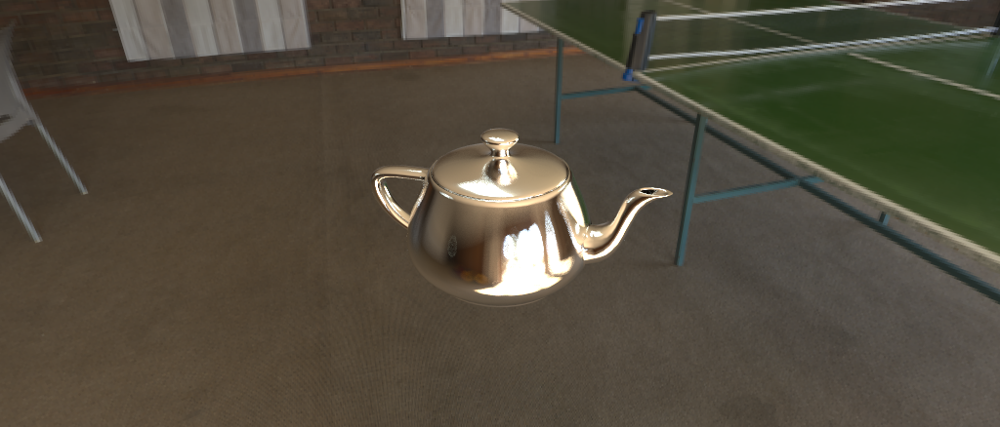
       Utah Teapot — slightly rough metal
    </td>
    <td align="center" width="33%">
      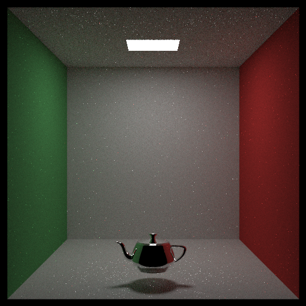
       Utah Teapot — Cornell box
    </td>
    <td align="center" width="33%">
      
       Stanford Dragon — metal, cloud skybox
    </td>
  </tr>
</table>

---

## Materials & Textures

<table>
  <tr>
    <td align="center" width="33%">
      
       Frosted glass sphere
    </td>
    <td align="center" width="33%">
      
       Glass sphere — restaurant HDR
    </td>
    <td align="center" width="33%">
      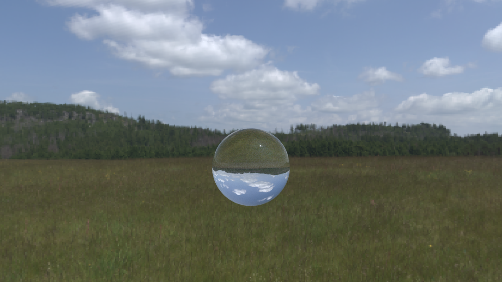
       Glass sphere — skybox reflection
    </td>
  </tr>
  <tr>
    <td align="center" width="33%">
      
       Glossy sphere — indoor HDR
    </td>
    <td align="center" width="33%">
      
       Sphere — normal map (foilwrap)
    </td>
    <td align="center" width="33%">
      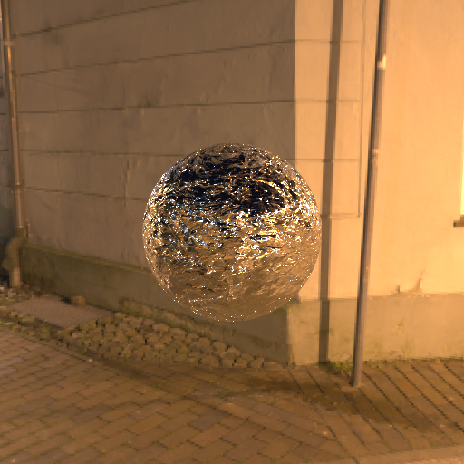
       Sphere — DX-style normal map
    </td>
  </tr>
  <tr>
    <td align="center" width="33%">
      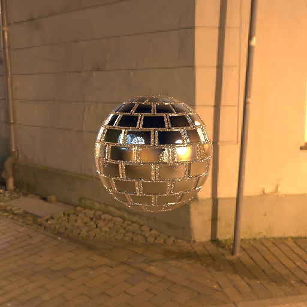
       Sphere — normal map variation
    </td>
    <td align="center" width="33%">
      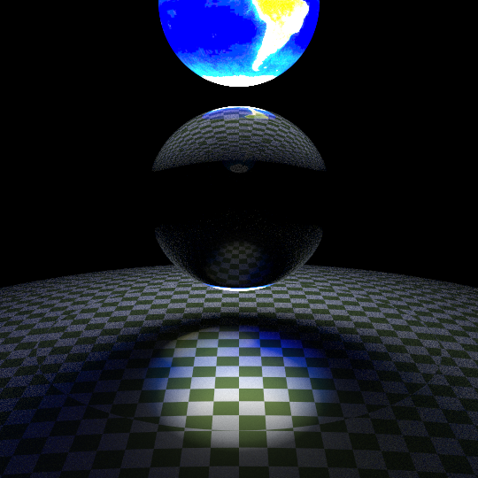
       Earth — emissive texture
    </td>
    <td align="center" width="33%">
      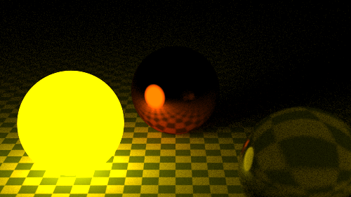
       Emissive sphere
    </td>
  </tr>
</table>

---

## Environment & Lighting

<table>
  <tr>
    <td align="center" width="33%">
      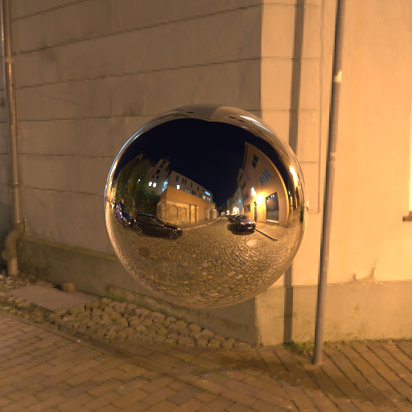
       Metal sphere — street HDR
    </td>
    <td align="center" width="33%">
      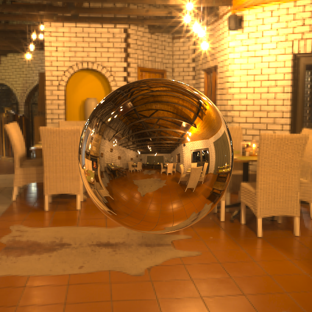
       Metal sphere — restaurant HDR
    </td>
    <td align="center" width="33%">
      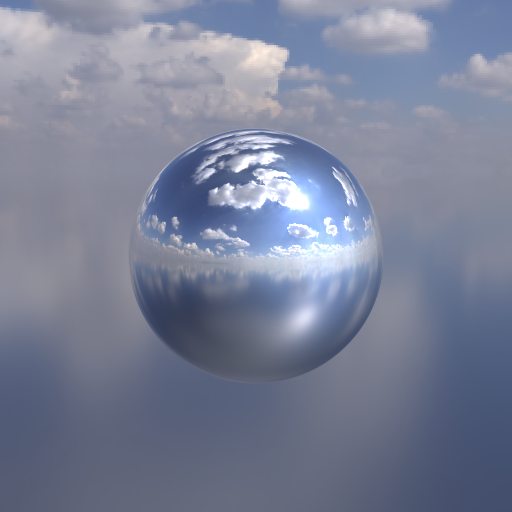
       Metal sphere — sky HDR
    </td>
  </tr>
  <tr>
    <td align="center" width="33%">
      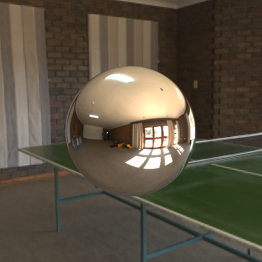
       Metal sphere — indoor HDR
    </td>
    <td align="center" colspan="2"/>
  </tr>
</table>

---

  Renders will continue to be added as the project grows. 
  <a href="README.md">← Back to README</a>

