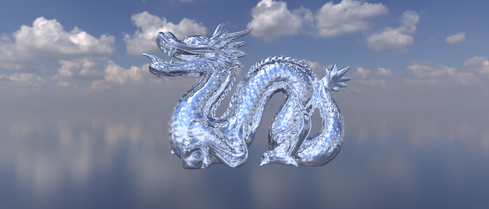

<p align="center">
  
</p>

# Custom C++ CPU Ray Tracer

<p align="center">
  
  
  
</p>

A CPU-based ray tracer built from scratch in C++. This project started as an implementation of Peter Shirley's Ray Tracing in One Weekend trilogy and has been expanded with advanced material systems, texture mapping, acceleration structures, and mesh loading.

## Key Features
### Primitives & Acceleration
- Supported Shapes: Spheres, Triangles, Quads, and OBJ Meshes.
- Mesh Loading: Load 3D models from OBJ files using TinyObjLoader. If vertex normals are not provided in the OBJ file, they are automatically generated based on face geometry.
- Efficiency: Uses BVH (Bounding Volume Hierarchy) to significantly speed up render times for complex scenes.
- Engine: Entirely CPU-based with no external graphics APIs (No OpenGL/DirectX).
- Multi-threading with OpenMP for faster rendering on multi-core processors.

### Materials & Rendering
#### Material Library: 
- Dielectric: Realistic glass and water.
- Frosted Glass: Rough refraction effects.
- Metal: Polished reflective surfaces.
- Glossy (Clear Coat): Multi-layered materials with a shiny finish.
- Diffuse Light: For area lights and glowing objects.
- Image Textured: Mapping 2D images onto 3D geometry.
#### Advanced Maps: 
Full support for Albedo, Normal, and Roughness maps to add surface detail.
#### Camera: 
Supports Depth of Field (defocus blur) for a cinematic look.

### Textures & Environment
#### Procedural Textures: 
Checker patterns, Solid colors, and Perlin Noise.
#### Skybox: 
Supports PNG, JPG, and HDR (High Dynamic Range).
> Note: HDR is preferred for much more realistic environmental lighting.

## Results


## Build Guide
### Prerequisites
- CMake (version 3.10 or higher).
- A C++ compiler (GCC/Clang/MSVC) supporting C++17 or higher.

### Steps to Run
#### 1. Clone the repo: 
``` 
git clone https://github.com/Anubhav-Mondal/ray-tracer
cd ray-tracer
```
#### 2. Make `build` folder:
```
mkdir build
cd build
```
#### 3. Generate build files:
```
cmake -DCMAKE_BUILD_TYPE=Release ..
```
#### 4. Build the project:
```
cmake --build .
```
#### 5. Run the Renderer:
Once compiled, run the executable.
#### a. On Windows:
```
./Release/raytracer
```
or
```
./Release/raytracer my_render.png
```
#### b. On Linux/Mac:
```
./raytracer
```
or
```
./raytracer my_render.png
```
#### Customizing Output
Pass the output filename as a CLI argument to set the name and format:
```
./raytracer my_render.png    # saves as PNG
./raytracer my_render.jpg    # saves as JPG
./raytracer my_render.hdr    # saves as HDR
```
If no argument is provided, defaults to `output.png`. The file will be saved in the `build` folder.

## Loading Meshes
Load OBJ files into your scenes:
```cpp
auto model = obj_loader("../models/filename.obj", material);
world.add(model);
```

## Roadmap (To-Do)
[ ] Scene saving/loading: Implement a simple scene description format (e.g., JSON or XML) to allow users to save and load their scenes without recompiling.

## Acknowledgments
- Ray Tracing in One Weekend series for the foundational math.

- `stb_image` and `tinyobjloader` for header-only utility support.
---
<p align="center">Created by <b>Anubhav Mondal</b></p>