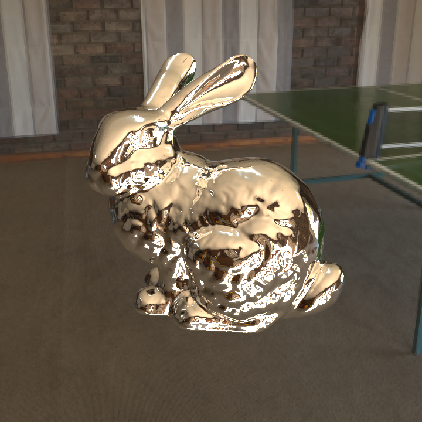
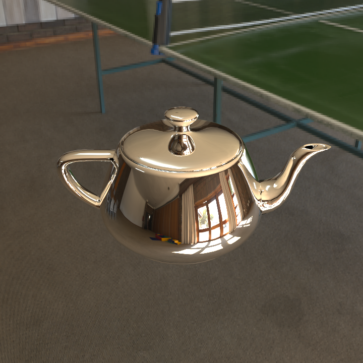
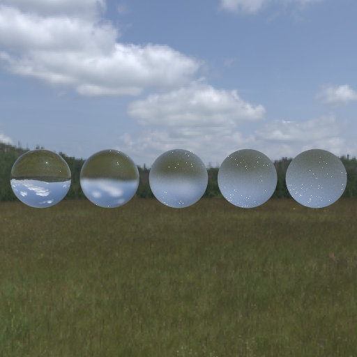
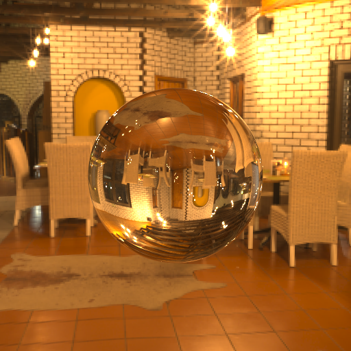
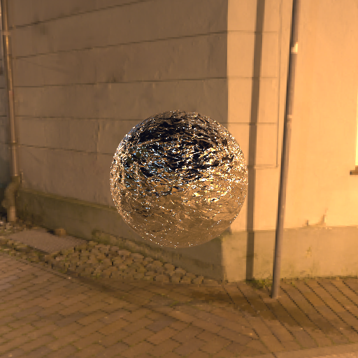
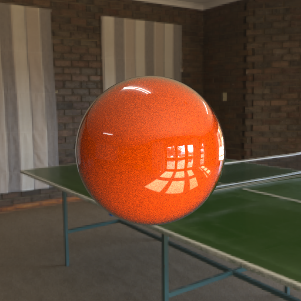

<p align="center">
  
</p>

# Custom C++ CPU Ray Tracer

<p align="center">
  
  
  
</p>

A CPU-based ray tracer built from scratch in C++. This project started as an implementation of Peter Shirley's Ray Tracing in One Weekend trilogy and has been expanded with advanced material systems, texture mapping, acceleration structures, mesh loading, a TOML-based scene file system, and a keyframe animation system for rendering path-traced videos.

## Key Features
### Primitives & Acceleration
- Supported Shapes: Spheres, Triangles, Quads, and OBJ Meshes.
- Mesh Loading: Load 3D models from OBJ files using TinyObjLoader. If vertex normals are not provided in the OBJ file, they are automatically generated based on face geometry.
- Efficiency: Uses BVH (Bounding Volume Hierarchy) to significantly speed up render times for complex scenes.
- Engine: Entirely CPU-based with no external graphics APIs (No OpenGL/DirectX).
- Multi-threading with OpenMP for faster rendering on multi-core processors.

### Scene File System
Scenes and render settings are defined in human-readable TOML files - no recompiling needed to change a scene.
- **`config.toml`**: render settings: resolution, samples, output path, animation toggle, and which scene to load
- **`scenes/*.toml`**: scene data: materials, objects, camera, skybox, and lights
- **`scenes/*.anim.toml`**: animation data: timeline, keyframes, and easing curves per property

### Animation System
Render path-traced videos from keyframe data defined in a `.anim.toml` file. The animation system evaluates all curves at each frame, rebuilds the scene with animated values, renders, and assembles the frames into an MP4 via ffmpeg automatically.

#### Animatable properties:
- Camera: `lookfrom`, `lookat`, `vfov`
- Object transforms: `translate.x/y/z`, `rotate_y`, `scale`
- Geometry: `radius` (spheres)
- Materials: `color.r/g/b`, `fuzz`, `roughness`, `ior`, `intensity`
#### Easing functions:
`linear`, `ease_in`, `ease_out`, `ease_in_out`

### Materials & Rendering
#### Material Library: 
- Dielectric: Realistic glass and water.
- Frosted Glass: Rough refraction effects.
- Metal: Polished reflective surfaces.
- Glossy (Clear Coat): Multi-layered materials with a shiny finish.
- Diffuse Light: For area lights and glowing objects.
- Image Textured: Mapping 2D images onto 3D geometry.
#### Advanced Maps: 
Full support for Albedo, Normal, and Roughness maps to add surface detail.
#### Camera: 
Supports Depth of Field (defocus blur) for a cinematic look.

### Textures & Environment
#### Procedural Textures: 
Checker patterns, Solid colors, and Perlin Noise.
#### Skybox: 
Supports PNG, JPG, and HDR (High Dynamic Range).
> **Note**: HDR is preferred for much more realistic environmental lighting.

### Denoising & Debugging
#### AI Denoising:
Integrated [Intel Open Image Denoise (OIDN) 2.4](https://github.com/RenderKit/oidn) for superior image quality at low sample counts. Toggle denoising via config file or CLI.
#### AOV Saving:
Debug rendering with albedo and normal Arbitrary Output Variables (AOV). Save these outputs alongside the final render for analysis and troubleshooting.

## Build Guide
### Prerequisites
- [CMake](https://cmake.org/download/) (version 3.10 or higher)
- A C++17 compiler — [GCC](https://gcc.gnu.org/), [Clang](https://clang.llvm.org/), or [MSVC](https://visualstudio.microsoft.com/downloads/) *(recommended on Windows)*
- [ffmpeg](https://ffmpeg.org/) — required for animation video export (`winget install Gyan.FFmpeg` on Windows)
### Steps to Run
#### 1. Clone the repo: 
``` 
git clone https://github.com/Anubhav-Mondal/ray-tracer
cd ray-tracer
```
#### 2. Make `build` folder:
```
mkdir build
cd build
```
#### 3. Generate build files:
```
cmake ..
```
#### 4. Build the project:
```
cmake --build . --config Release
```
#### 5. Go back to the project root:
```
cd ..
```
#### 6. Run the Renderer:
Once compiled, run the executable.
#### a. On Windows:
```
./build/Release/RayTracer
```
#### b. On Linux/Mac:
```
./build/RayTracer
```

## Customizing Renders
### Using config files
Edit `config.toml` to change render settings:
```toml
scene_path        = "scenes/cornell_box.toml"
output            = "renders/cornell_box.png"
width             = 1024
samples_per_pixel = 500
denoise           = true
save_aov          = false
 
# Animation
anim        = false
anim_path   = "scenes/scene.anim.toml"
anim_output = "renders/output.mp4"
keep_frames = false
```

### Using CLI overrides
Override any config value without editing files:
```
./build/Release/RayTracer --spp 20 --width 400           # quick preview
./build/Release/RayTracer --scene-path scenes/scene.toml # different scene
./build/Release/RayTracer --output renders/final.png     # different output
./build/Release/RayTracer --spp 50 --denoise             # denoise output
./build/Release/RayTracer --save-aov                     # save AOV maps
./build/Release/RayTracer --anim                         # render animation
./build/Release/RayTracer --anim --fps 12                # preview at 12fps
./build/Release/RayTracer --anim --keep-frames           # keep frame cache
```
Supported flags:
 
| Flag | Description |
|---|---|
| `--scene-path` | Path to scene `.toml` file |
| `--output` | Output filename (`.png`, `.jpg`, or `.hdr`) |
| `--spp` | Samples per pixel |
| `--width` | Image width in pixels |
| `--depth` | Max ray bounce depth |
| `--denoise` / `--no-denoise` | Toggle OIDN denoising |
| `--save-aov` / `--no-save-aov` | Toggle AOV saving |
| `--anim` / `--no-anim` | Toggle animation mode |
| `--anim-path` | Path to `.anim.toml` file |
| `--anim-output` | Output `.mp4` path |
| `--fps` | Override animation fps |
| `--keep-frames` / `--no-keep-frames` | Keep or delete frame cache after export |
 
You can also pass a custom config file as the first argument:
```
./build/Release/RayTracer my_config.toml
./build/Release/RayTracer my_config.toml --spp 50 --anim
```
 
---

## Loading Meshes
Load OBJ files into your scenes via the scene file:
```toml
[[object]]
name      = "dragon"        # required if you want to animate this object
type      = "mesh"
path      = "models/filename.obj"
material  = "my_material"
scale     = 100.0
translate = [0, 0, 0]
rotate_y  = 45.0
```
---

## Results
<table>
  <tr>
    <td align="center"></td>
    <td align="center"></td>
  </tr>
  <tr>
    <td align="center"></td>
    <td align="center"></td>
  </tr>
  <tr>
    <td align="center"></td>
    <td align="center"></td>
  </tr>
</table>
<p>
Checkout the <a href="GALLERY.md">Gallery</a> for more renders and details on materials, textures, and scenes!
</p>

## Roadmap (To-Do)
- [ ] Temporal Anti-Aliasing (TAA) / Motion Vectors - reduce shimmering in animations.
- [ ] More 3D format support.

## Acknowledgments
- Ray Tracing in One Weekend series for the foundational math.
- `stb_image` and `tinyobjloader` for header-only utility support.
- [Intel Open Image Denoise](https://github.com/RenderKit/oidn) for AI denoising.
- [ffmpeg](https://ffmpeg.org/) for video assembly.

---
<p align="center">Created by <b>Anubhav Mondal</b></p>